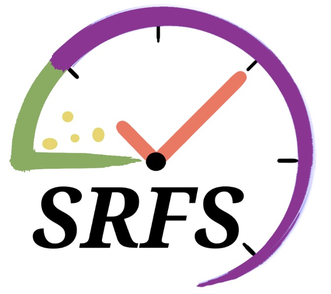

# SRFS: Sample-based Response Feature Selection 
    
SRFS evaluated each feature's discriminative power between sensitive and resistant groups at the sample level and derived the feature's contribution to IR and AR at the patient level.

